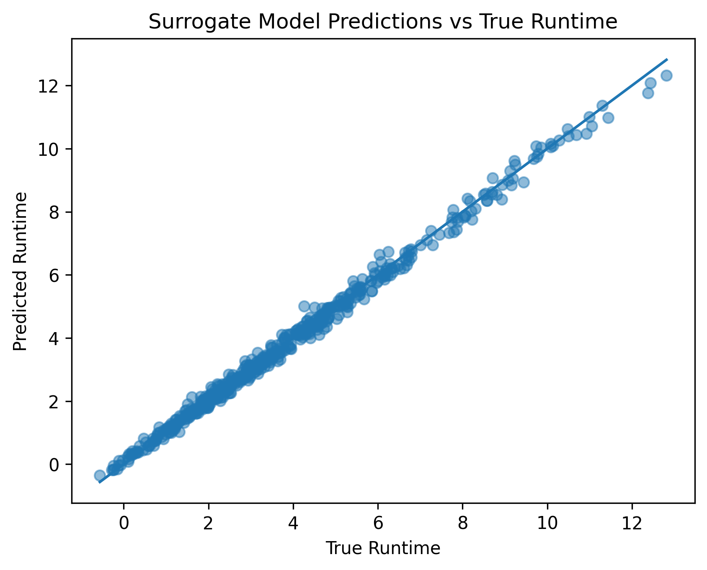
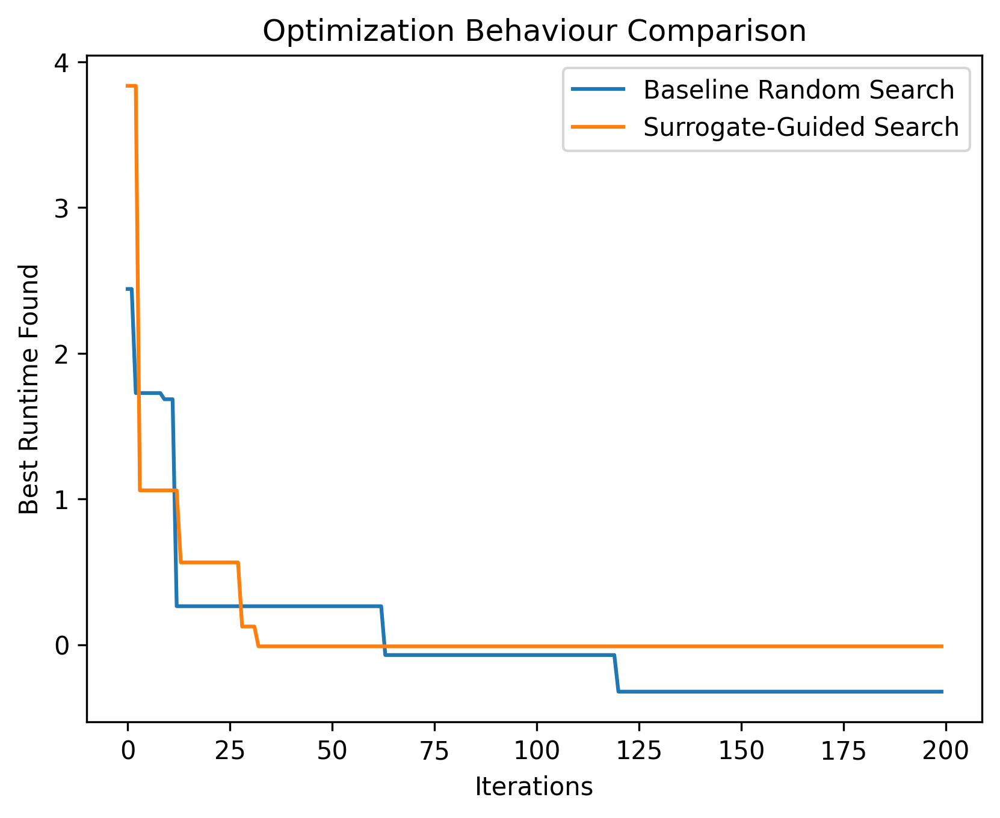

# Surrogate-Based Black-Box Optimization for System Performance Modeling

## Overview

Optimizing real-world systems is often challenging because their internal behavior is unknown, evaluations are expensive, and analytical gradients are unavailable. This project investigates a surrogate-based black-box optimization framework for modeling and improving nonlinear system performance under noisy conditions.

Instead of repeatedly querying the true system, a data-driven surrogate model is trained from sampled observations and used to guide derivative-free optimization. The objective is to study efficiency, reliability, and trade-offs in surrogate-assisted decision making.

Many computing and engineering systems exhibit complex performance behavior:

- System responses are nonlinear  
- Evaluations may be expensive or slow  
- Observations are noisy  
- Analytical gradients may not exist  

Traditional optimization techniques struggle in such environments. Surrogate modeling offers a practical alternative by approximating system behavior from data and enabling efficient optimization.

---

## System Formulation

A synthetic black-box system is simulated:

**Inputs (tunable parameters):**

- x1 — System parameter 1  
- x2 — System parameter 2  
- x3 — System parameter 3  

**Output (objective):**

- Runtime / performance metric (minimized)

The true system is intentionally nonlinear and noisy to mimic realistic optimization challenges encountered in practical systems.

---

## Methodology

The framework consists of:

1. **Black-Box System Simulation**  
   Unknown nonlinear system behavior is modeled via a hidden function.

2. **Data Sampling**  
   Random inputs are evaluated to generate empirical observations.

3. **Surrogate Modeling**  
   A Random Forest Regressor approximates system responses.

4. **Derivative-Free Optimization**  
   Search strategies operate without gradient information.

5. **Comparative Evaluation**  
   Baseline random search is compared with surrogate-guided search.

---

## Key Concepts Demonstrated

- Black-box optimization  
- Surrogate modeling  
- Regression-based system approximation  
- Derivative-free optimization  
- Exploration vs exploitation dynamics  
- Approximation error effects  
- Noise robustness  

---

## Results and Insights

Experiments illustrate that:

- Surrogate models can accelerate optimization  
- Prediction accuracy influences reliability  
- Noise affects convergence behavior  
- Surrogates may misguide search  
- Trade-offs exist between exploration and exploitation  

The emphasis is on reasoning about system behavior rather than maximizing numerical performance.

---

## Visualizations

### Surrogate Model Prediction Accuracy

This figure compares surrogate model predictions against true system runtime, illustrating how well the learned approximation captures nonlinear system behavior.

---

### Optimization Behaviour Comparison

This figure compares baseline random search with surrogate-guided search, highlighting the impact of surrogate modeling on optimization dynamics.

---

## Limitations

- Synthetic system (conceptual demonstration)  
- Low-dimensional parameter space  
- No constraints modeling  
- Surrogate approximation bias  

These simplifications preserve conceptual validity while keeping experiments interpretable.

---

## Conclusion

This project demonstrates how data-driven surrogate models can support optimization in systems where direct analytical approaches are infeasible. The study emphasizes modeling assumptions, optimization dynamics, and approximation trade-offs.
